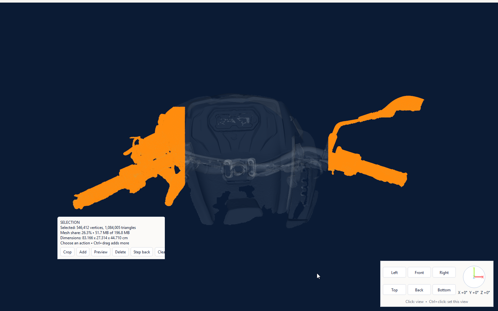
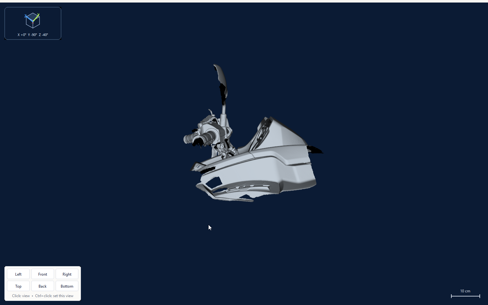
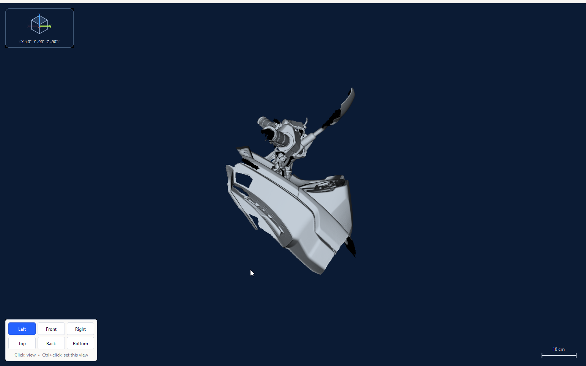

<p align="center">
  
</p>

MeshMill is a focused desktop application for making oversized, dense, or difficult mesh geometry
manageable. It provides fast inspection, density analysis, regional selection, cropping, deletion,
and controlled mesh reduction without requiring an account or uploading geometry.

MeshMill works with meshes from 3D scanners, CAD and modeling exports, reconstruction pipelines,
generated geometry, and other STL sources. It prepares geometry for downstream editors,
manufacturing tools, and other mesh workflows. General-purpose modeling, sculpting, animation,
materials, and scene creation are outside its scope.

## Screenshots

### Shaded geometry


### Density analysis


### Regional selection



### Saved orientation views





## Download

Download one of these files from [GitHub Releases](../../releases):

- `MeshMill-<version>-windows-x64-setup.exe`: per-user installer with Start menu and optional
  desktop shortcuts.
- `MeshMill-<version>-windows-x64-portable.zip`: portable application. Extract the entire archive,
  then run `MeshMill.exe`.

Both packages include the application runtime. End users do not install Python, Node.js, or
dependencies. The initial release supports Windows 10 and Windows 11 on x64 hardware. Linux and
macOS packages are planned; the product and file formats are not Windows-specific.

Unsigned community builds may display a Windows SmartScreen warning. Release checksums are listed
in `SHA256SUMS.txt` beside each release.

## Quick start

1. Open an STL.
2. Inspect it in Shaded, Density, Wireframe, or Vertices display mode.
3. Choose a quality level, algorithm, and target triangle count.
4. Select **Optimize** to calculate a result.
5. Compare the original and optimized meshes, then select **Apply** to commit the pass.
6. Select **Save current state** or press `Ctrl+S`.

MeshMill never starts optimization merely because a file or setting changed.

## Capabilities

- Binary and ASCII STL input, binary STL output
- Fast QEM, density-balanced, shape-preserving, and topology-preserving reduction
- Shaded, density, wireframe, and vertex display modes
- Automatic targets derived from geometry rather than a fixed triangle ceiling
- Polygon selection with additive multi-region selection
- Crop, delete, or optimize only the selected region
- Cached original, previous, and current mesh comparison
- Undo and redo for committed geometry changes
- Dimension drift, reduction percentage, and estimated output size
- Millimeter, centimeter, meter, inch, and foot display units
- CPU, memory, GPU, and geometry-activity metrics
- Bounded overview loading when a binary STL exceeds the configured memory budget
- GUI and command-line applications
- Local processing with no account, telemetry, upload, or cloud dependency

## View controls

| Input | Action |
| --- | --- |
| Middle-drag | Orbit |
| Shift + middle-drag | Pan |
| Mouse wheel | Zoom toward the pointer |
| Ctrl + mouse wheel | Roll clockwise or counterclockwise |
| Arrow keys | Orbit around the view center |
| Ctrl + arrow keys | Pan |
| Ctrl + Shift + Up/Down | Zoom |
| Ctrl + Shift + Left/Right | Roll |
| `F1` / `F2` / `F3` / `F4` | Shaded / Density / Wireframe / Vertices |
| Right mouse hold | Magnifier |
| Shift + left-click | Add or remove ruler points |
| Ctrl + left-drag | Draw a selection polygon |
| `Ctrl+C` | Add the polygon to the saved selection |
| `Ctrl+X` | Crop to the selection |
| `Ctrl+Space` | Optimize the selection |
| `Delete` | Delete the selection |
| `Escape` | Clear the active selection or ruler |
| `Ctrl+Z` / `Ctrl+Y` | Undo / redo |
| `Ctrl+S` | Save the current mesh state |

Standard view keys follow the six-key navigation block:

| Key | View | Ctrl + key |
| --- | --- | --- |
| `Insert` | Left | Set current orientation as Left |
| `Home` | Front | Set current orientation as Front |
| `Page Up` | Right | Set current orientation as Right |
| `Delete` | Top when no selection exists | Set current orientation as Top |
| `End` | Back | Set current orientation as Back |
| `Page Down` | Bottom | Set current orientation as Bottom |

Saving a view also updates its opposite view. Left and Right, Front and Back, and Top and Bottom
remain paired. In the confirmation dialog, **Save** is the default action, so Enter saves the
orientation. Front appears at the top of both Top and Bottom views.

Shortcuts can be changed or reset in Settings.

## Selection workflow

Hold Ctrl and left-drag to draw a polygon. Drag corners to reshape it, left-click an edge to add a
point, or right-click an edge to remove one. Add more regions with `Ctrl+C`. Moving the camera hides
the screen-space polygon while retaining the selected geometry.

Optimization with an active selection affects that selection only. The result remains provisional
until **Apply** is selected. **Cancel** discards the provisional result and retains the selection so
another configuration can be tried. Crop and delete operations become normal undoable mesh edits.

## Large meshes

Before allocating a binary STL, MeshMill compares its estimated working memory with the configured
memory budget. A file above the budget opens as a bounded, read-only overview. The overview reports
the full source triangle count but disables editing and export because it is a sample, not the full
object. Indexed, zoom-dependent out-of-core processing is planned in
[docs/OUT_OF_CORE.md](docs/OUT_OF_CORE.md).

## Command line

`MeshMillCLI.exe` is included in both release packages:

```powershell
.\MeshMillCLI.exe "C:\path\mesh.stl" --preset balanced
.\MeshMillCLI.exe "C:\path\mesh.stl" --target 150000 --output "C:\path\mesh-reduced.stl"
.\MeshMillCLI.exe "C:\path\mesh.stl" --algorithm density --target 150000
.\MeshMillCLI.exe "C:\path\mesh.stl" --algorithm topology --overwrite
```

Run `.\MeshMillCLI.exe --help` for all options. MeshMill refuses to overwrite its input file.

## Sample geometry

Two versions of the development sample are available. The sample is a composite mesh with
intentional layers of redundant geometry and varied density. It gives people without a scanner a
realistic fixture for comparing algorithms, inspecting density, exercising regional operations,
and developing roadmap features. MeshMill does not require scanned input.

| File | Triangles | Size | Delivery | Best for |
| --- | ---: | ---: | --- | --- |
| [`sample-scan.stl`](samples/sample-scan.stl) | 249,999 | 11.9 MiB | Normal Git | Quick evaluation, CI, and learning the controls |
| [`original-scan.stl`](samples/original-scan.stl) | 4,126,315 | 196.8 MiB | Git LFS | Testing dense source geometry and large-mesh performance |

The smaller sample is downloaded with every normal clone. The untouched original is optional and
managed through Git LFS so it does not inflate ordinary repository history. GitHub Desktop includes
Git LFS. Command-line users can install Git LFS and run:

```powershell
git lfs pull --include="samples/original-scan.stl"
```

Tagged releases also publish the original STL as a direct download for people who do not use Git.
See [`samples/README.md`](samples/README.md) for provenance, dimensions, and checksums.

Algorithm contributors should also read the
[algorithm testing guide](docs/ALGORITHM_TESTING.md) before comparing or changing reduction
behavior.

## STL units

STL does not encode a unit. Changing Model units changes labels and measurements without scaling
the saved coordinates. Select the unit that describes the source geometry.

## Privacy

MeshMill reads and writes local files. It contains no account, telemetry, upload, advertising, or
cloud-processing feature. The current GPU metrics implementation uses local Windows performance
counters. Equivalent native metrics providers are planned for Linux and macOS.

For diagnostic troubleshooting, developers can start the GUI with
`--diagnostic-log <local-file.jsonl>`. The log records input routing and camera state locally and is
disabled during normal use.

## Development and release

- [Contributing](CONTRIBUTING.md)
- [Release process](RELEASING.md)
- [Roadmap](ROADMAP.md)
- [Troubleshooting](docs/TROUBLESHOOTING.md)
- [Third-party notices](THIRD_PARTY_NOTICES.md)

## Support MeshMill

MeshMill is independently developed and maintained. Read
[why supporting this work matters](SUPPORT.md), or support continued development through
[Buy Me a Coffee](https://buymeacoffee.com/tednv).

MeshMill is licensed under the GNU General Public License, version 3 or later. See
[`LICENSE`](LICENSE).
