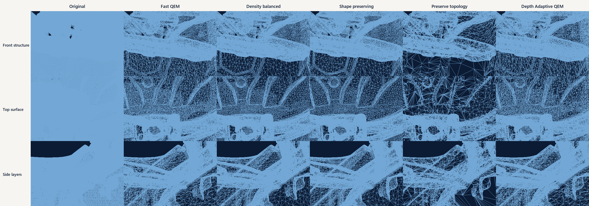
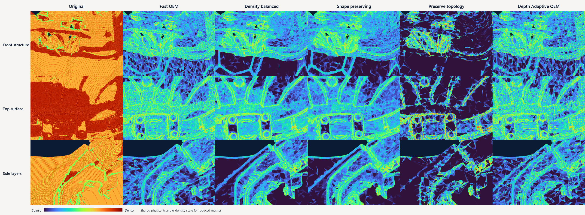

# Depth Adaptive QEM compared with production algorithms

The comparison uses `samples/original-scan.stl`, one resident indexed input mesh, and a target of
250,000 triangles. The source contains 4,126,315 triangles and 2,070,061 vertices. Every reducer was
timed in the same Python process after the source connectivity had been constructed. Depth Adaptive
QEM time includes GPU surface analysis and its boundary-preserving Fast QEM pass.

Depth Adaptive QEM originated with the project author's physical depth-gauge model. Published GPU
simplification work supplied comparison strategies, not this adaptive-probe design. See the
[complete derivation and failure analysis](../docs/DEPTH_GAUGE_REDUCTION.md).

### Close wireframe comparison

The matched close views expose triangle placement, edge collapse, open boundaries, layered surfaces,
and local changes that a shaded overview conceals. The original column is expected to appear nearly
solid because it contains more than 4.1 million triangles. Each reduced column contains about
250,000 triangles.

### Close density comparison

Density color is derived from physical triangle area. Blue regions have larger, sparser triangles;
red regions have smaller, denser triangles. All reduced results use the same physical color scale,
so color differences show where each algorithm spent or removed its triangle budget. The original
uses that same scale and therefore saturates toward the dense end.

## Numerical results

| Algorithm | Time | Triangles | Vertices | RMS | P95 | Max drift | Area error | Boundary edges | Non-manifold edges |
| --- | ---: | ---: | ---: | ---: | ---: | ---: | ---: | ---: | ---: |
| Fast QEM | **9.827 s** | 249,999 | 127,010 | 1.1721 mm | 2.3504 mm | 0.6987 mm | 0.3993% | 4,329 | 54 |
| Density balanced | 11.439 s | 249,999 | 131,947 | 1.2041 mm | 2.4341 mm | 0.0030 mm | **0.0405%** | 14,215 | 52 |
| Shape preserving | 56.404 s | 250,000 | 130,299 | 1.1933 mm | 2.3323 mm | 0.0009 mm | 0.0491% | 10,892 | 26 |
| Preserve topology | 35.656 s | 249,999 | 131,903 | 3.1672 mm | 6.8266 mm | **0.0000 mm** | 0.0709% | 14,215 | **5** |
| Depth Adaptive QEM | 10.156 s | 249,999 | 131,951 | **1.0668 mm** | **2.0586 mm** | 0.0234 mm | 0.1241% | 14,215 | 48 |

## Reading the result

Depth Adaptive QEM has the best sampled RMS and P95 surface distance. It retains the
source's 14,215 open-boundary edges and has substantially lower envelope and area error than Fast
QEM. Across three complete resident runs, it took 10.481, 10.112, and 10.156 seconds. The median was
10.156 seconds. That is 1.283 seconds faster than Density balanced and 0.329 seconds slower than Fast
QEM on this machine.

Density balanced remains better at preserving the exact bounding-box envelope and total surface
area. Preserve topology remains best at limiting non-manifold edges and dimension drift, but its
sampled surface error is much higher. Shape preserving is accurate but considerably slower.

The images use the same source bounds, orthographic cameras, focal points, zoom, and scale for every
column. The three rows inspect the same front structure, top surface, and layered side geometry.

## Timing scope

The resident timings exclude the shared STL connectivity construction because an open
MeshMill model already has indexed vertices and faces. They also exclude display rendering, quality
measurement, and output-file writing. The benchmark writes its raw timing report to the output
path supplied on the command line.
