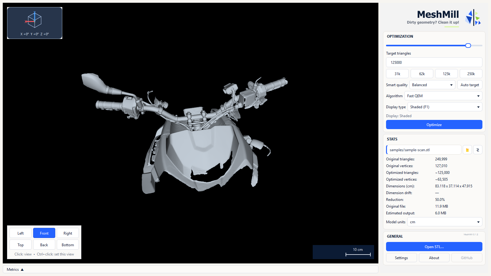
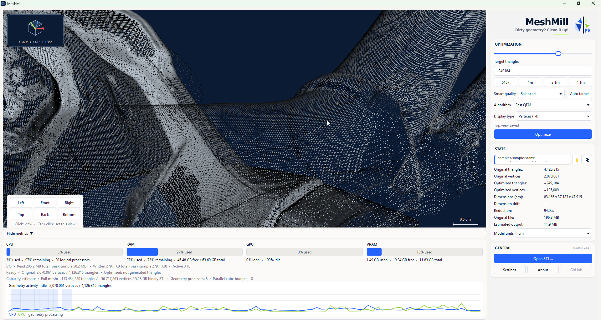
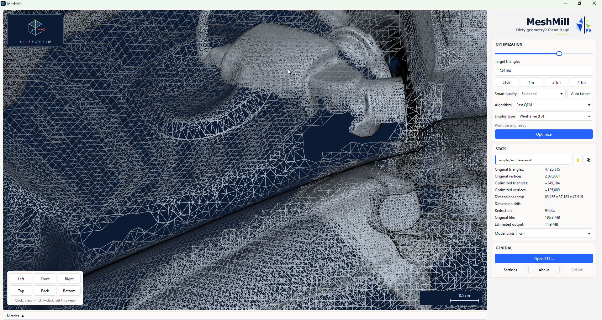
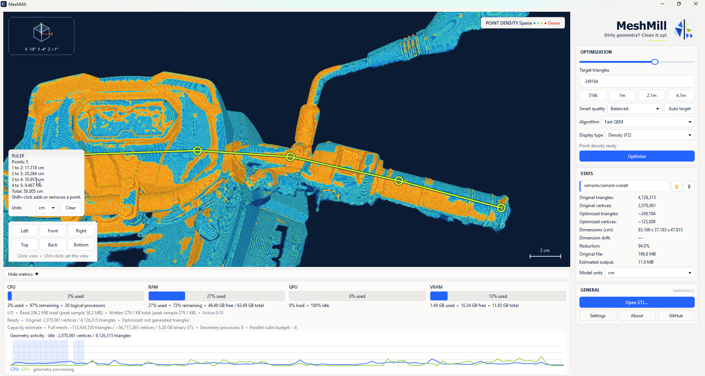
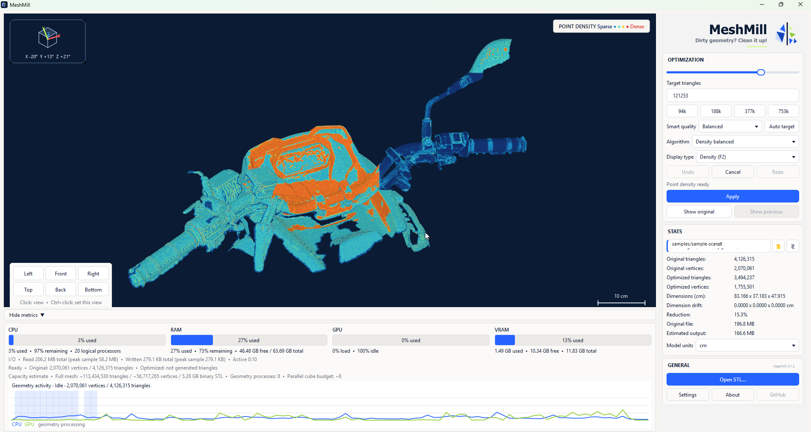
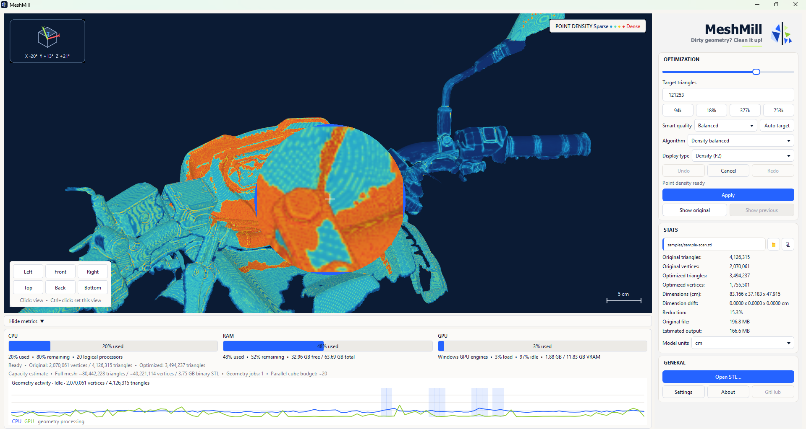
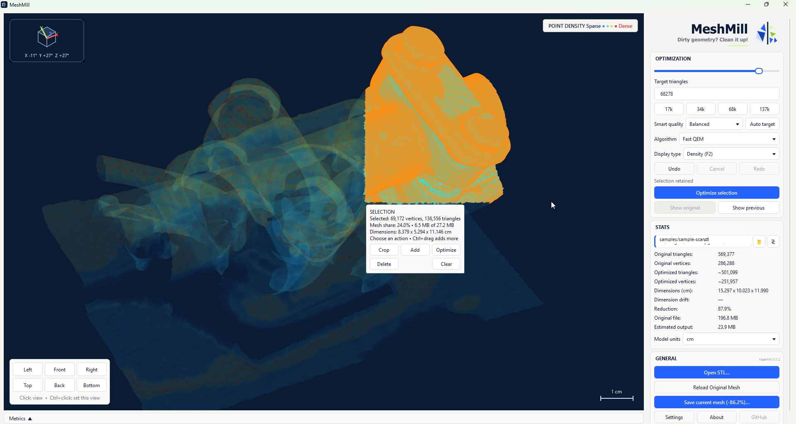

<p align="center">
  
</p>

MeshMill — це спеціалізований настільний застосунок для роботи з великогабаритною, щільною або складною полігональною геометрією (мешами),
що робить її зручною для обробки. Він забезпечує швидкий огляд, аналіз щільності, виділення окремих ділянок, обрізання, видалення,
а також контрольоване зменшення кількості полігонів без необхідності створення облікового запису чи завантаження геометрії на сервер.

Візуалізація OpenGL із прискоренням GPU зберігає навігацію у вікні перегляду, вибір обладнання, візуалізацію щільності,
та інтерактивна інспекція. Зменшення сітки наразі працює в окремих власних робочих процесорах, (CPU)
зберігаючи довгі обчислення геометрії подалі від інтерфейсу.

MeshMill працює з моделями, отриманими з 3D-сканерів, експортованими з CAD-систем і програм для моделювання, результатами процесів реконструкції,
згенерованою геометрією та іншими джерелами. Програма готує геометрію для подальшої обробки в інших редакторах, (STL)
виробничому обладнанні та інших робочих процесах. Моделювання загального призначення, скульптинг, анімація,
робота з матеріалами та створення сцен виходять за межі її функціональності.

## Завантаження

Завантажте один із цих файлів зі сторінки [релізів GitHub](../../releases):

- `MeshMill-<version>-windows-x64-setup.exe`: інсталятор для окремого користувача з додаванням до меню «Пуск» і можливістю
  створення ярликів на робочому столі.
- `MeshMill-<version>-windows-x64-portable.zip`: портативна версія. Розпакуйте весь архів,
  а потім запустіть `MeshMill.exe`.

Обидва пакети містять необхідні для роботи програми компоненти (runtime). Кінцеві користувачі не встановлюють Python, Node.js або
залежності. Стабільний випуск підтримує Windows 10 і Windows 11 на обладнанні x64.

Непідписані пакети попереднього перегляду Linux x86-64 і macOS Intel/Apple також можуть з’являтися у випусках.
Вони створені на базі власних раннерів, розміщених на GitHub, і проходять пакетні тести CLI та димові тести зразкової сітки,
але все одно потребує тестування на реальному обладнанні. Перегляньте [Попереднє тестування Linux і macOS](../../PLATFORM_TESTING.md)
перед встановленням або звітом про результати.

Непідписані збірки спільноти можуть відображати попередження Windows SmartScreen або macOS Gatekeeper. Звільнення
контрольні суми вказані біля кожного випуску.

## Швидкий початок

1. Відкрийте STL.
2. Перегляньте об’єкт у режимі відображення Shaded (Затінення), Density (Щільність), Wireframe (Каркас) або Vertices (Вершини).
3. Виберіть рівень якості, алгоритм і цільову кількість трикутників.
4. Натисніть **Optimize** (Оптимізувати), щоб обчислити результат.
5. Порівняйте оригінальну та оптимізовану сітки, а потім натисніть **Apply** (Застосувати), щоб підтвердити операцію.
6. Виберіть **Save current state** (Зберегти поточний стан) або натисніть `Ctrl+S`.

MeshMill ніколи не запускає оптимізацію лише через зміну файлу чи налаштування.

## Можливості

- Введення даних у форматах Binary та ASCII STL, виведення у форматі Binary STL
- Зменшення кількості полігонів (редукція) зі збереженням щільності, форми та топології (Fast QEM)
- Вікно перегляду OpenGL із прискоренням графічного процесора, апаратний вибір і візуалізація щільності (GPU)
- Нативні робочі фонові геометрії для зменшення сітки
- Режими відображення: затінення (shaded), щільність, каркас (wireframe) та вершини
- Автоматичне визначення цільових параметрів на основі геометрії, а не фіксованого ліміту кількості трикутників
- Вибір полігонів із можливістю адитивного виділення кількох областей
- Обрізання, видалення або оптимізація лише вибраної області
- Порівняння кешованих версій сітки: початкової, попередньої та поточної
- Скасування та повторне виконання (Undo/Redo) застосованих змін геометрії
- Відхилення розмірів, відсоток зменшення та оціночний розмір вихідного файлу
- Одиниці вимірювання: міліметри, сантиметри, метри, дюйми та фути
- Показники: CPU, пам'ять, GPU та активність геометрії
- Обмежене завантаження оглядової версії, якщо бінарний файл STL перевищує налаштований ліміт пам'яті
- Програми з графічним інтерфейсом (GUI) та інтерфейсом командного рядка
- Локальна обробка без потреби в обліковому записі, телеметрії, завантаженні даних у мережу чи хмарних сервісах

## Перевірте геометрію перед її зменшенням

Затінений дисплей забезпечує чітке бачення поверхні та силуету. Це корисно для порівняння
збереження форми перед застосуванням проходу оптимізації.



Дисплей Вершини показує фактичний розподіл точок. Щільні області сканування, розріджені області та
різкі зміни у вибірці видно без зміни геометрії. Розширена панель показників
відстежує процес обробки процесора, пам’яті, графічного процесора та геометрії під час роботи з сіткою. (GPU) (CPU)



Дисплей Wireframe безпосередньо показує трикутну структуру. Допомагає виявити непотрібну густоту,
нерегулярна тріангуляція та регіони, де спрощення може видалити істотну геометрію.



## Проаналізуйте щільність сітки

Відображення щільності відображає відносну локальну щільність у моделі. Розріджені ділянки залишаються прохолодними
дедалі щільніші області переміщуються через яскравіші кольори, роблячи нерівномірну вибірку помітною з першого погляду.



Під час оцінки попередньої оптимізації щільність залишається доступною. Панель інструментів повідомляє про
алгоритм, мета, результуюча кількість трикутників і вершин, відсоток зменшення, розміри та
передбачуваний вихідний розмір перед застосуванням проходу.



Утримуйте праву кнопку миші, щоб перевірити область через круглу лупу. Збільшений вид
залишається в центрі вказівника та показує локальну щільність без зміни положення головної камери.



## Елементи керування переглядом

| Введення | Дія |
| --- | --- |
| Перетягування середньою кнопкою миші | Обертання |
| Shift + перетягування середньою кнопкою миші | Панорамування |
| Коліщатко миші | Масштабування до вказівника |
| Ctrl + коліщатко миші | Обертання за годинниковою стрілкою або проти неї |
| Клавіші зі стрілками | Обертання навколо центру огляду |
| Ctrl + клавіші зі стрілками | Панорамування |
| Ctrl + Shift + Вгору/Вниз | Масштабування |
| Ctrl + Shift + ліворуч/праворуч | Рулон |
| `F1` / `F2` / `F3` / `F4` | Затінені / Щільність / Каркас / Вершини |
| Утримуйте праву кнопку миші | Екранна лупа |
| Shift + клацання лівою кнопкою миші | Додати або видалити точки лінійки |
| Ctrl + перетягування лівою кнопкою | Намалюйте виділений багатокутник |
| `Ctrl+C` | Додайте багатокутник до збереженого виділення |
| `Ctrl+X` | Обрізати до виділення |
| `Ctrl+Space` | Оптимізувати вибір |
| `Delete` | Видалити виділення |
| `Escape` | Очистити активне виділення або лінійку |
| `Ctrl+Z` / `Ctrl+Y` | Скасувати / повторити |
| `Ctrl+S` | Зберегти поточний стан сітки |

Клавіші стандартного перегляду слідують за блоком навігації з шести клавіш:

| Ключ | Переглянути | Ctrl + клавіша |
| --- | --- | --- |
| `Insert` | Ліворуч | Установити поточну орієнтацію як Ліворуч |
| `Home` | Передня | Установити поточну орієнтацію як Front |
| `Page Up` | Право | Установити поточну орієнтацію як Праворуч |
| `Delete` | Вгору, якщо немає вибору | Установити поточну орієнтацію як Top |
| `End` | Назад | Установіть поточну орієнтацію як Назад |
| `Page Down` | Нижній | Установити поточну орієнтацію як Нижня |

Збереження перегляду також оновлює його протилежний вигляд. Зліва і справа, спереду і ззаду, зверху і знизу
залишатися в парі. У діалоговому вікні підтвердження **Зберегти** є дією за замовчуванням, тому Enter збереже
орієнтація. Лицьова сторона з’являється у верхній частині подання «Зверху» та «Знизу».

Ярлики можна змінити або скинути в налаштуваннях.

## Процес вибору

Утримуйте Ctrl і перетягніть ліву кнопку, щоб намалювати багатокутник. Перетягніть кути, щоб змінити форму, клацніть край лівою кнопкою миші, щоб додати a
або клацніть правою кнопкою миші край, щоб видалити його. Додайте більше регіонів за допомогою `Ctrl+C`. Переміщення камери ховається
багатокутник екранного простору, зберігаючи вибрану геометрію.

Оптимізація з активним вибором впливає лише на цей вибір. Результат залишається тимчасовим
доки не буде вибрано **Застосувати**. **Скасувати** скидає попередній результат і зберігає вибір
можна спробувати іншу конфігурацію. Операції обрізання та видалення стають звичайними незмінними редагуваннями сітки.

Панель вибору повідомляє про кумулятивні вибрані вершини, трикутники, частку сітки, оцінку
розмір і розміри. Його дії обрізають, додають, оптимізують, видаляють, відступають або очищають збережене
виділення, не приховуючи навколишню геометрію.



## Великі сітки

Перед виділенням двійкового STL MeshMill порівнює свою приблизну робочу пам’ять із налаштованою
бюджет пам'яті. Файл над бюджетом відкривається як обмежений огляд лише для читання. Огляд звітів
повна кількість вихідних трикутників, але вимикає редагування та експорт, оскільки це зразок, а не повний
об'єкт. Планується індексована позаядерна обробка, яка залежить від масштабу
[docs/OUT_OF_CORE.md](docs/OUT_OF_CORE.md).

## Командний рядок

`MeshMillCLI.exe` входить до обох пакетів випуску:

```powershell
.\MeshMillCLI.exe "C:\path\mesh.stl" --preset balanced
.\MeshMillCLI.exe "C:\path\mesh.stl" --target 150000 --output "C:\path\mesh-reduced.stl"
.\MeshMillCLI.exe "C:\path\mesh.stl" --algorithm density --target 150000
.\MeshMillCLI.exe "C:\path\mesh.stl" --algorithm topology --overwrite
```

Запустіть `.\MeshMillCLI.exe --help` для всіх параметрів. MeshMill відмовляється перезаписувати свій вхідний файл.

## Зразок геометрії

Доступні дві версії зразка розробки. Зразок являє собою композитну сітку з
навмисні шари надлишкової геометрії та різної щільності. Це дає людям без сканера a
реалістичний прилад для порівняння алгоритмів, перевірки щільності, здійснення регіональних операцій,
і розробка функцій дорожньої карти. MeshMill не вимагає сканованого введення.

| Файл | Трикутники | Розмір | Доставка | Найкраще для |
| --- | ---: | ---: | --- | --- |
| [`sample-scan.stl`](../../../samples/sample-scan.stl) | 249 999 | 11,9 МіБ | Звичайний Git | Швидка оцінка, CI та вивчення елементів керування | (249,999)
| [`оригінальний-скан.stl`](../../../samples/original-scan.stl) | 4 126 315 | 196,8 МіБ | Git LFS | Тестування щільної геометрії джерела та продуктивності великої сітки | (4,126,315)

Менший зразок завантажується з кожним звичайним клоном. Недоторканий оригінал необов'язковий і
керується через Git LFS, тому він не роздуває звичайну історію сховища. GitHub Desktop включає в себе
Git LFS. Користувачі командного рядка можуть встановити Git LFS і запустити:

```powershell
git lfs pull --include="samples/original-scan.stl"
```

Випуски з тегами також публікують оригінальний STL для прямого завантаження для людей, які не використовують Git.
Дивіться [`samples/README.md`](../../../samples/README.md) щодо походження, розмірів і контрольних сум.

Автори алгоритмів також повинні прочитати
[посібник з тестування алгоритму](docs/ALGORITHM_TESTING.md) перед порівнянням або зміною скорочення
поведінка.

## STL одиниць

STL не кодує одиницю. Зміна одиниць моделі змінює мітки та вимірювання без масштабування
збережені координати. Виберіть одиницю, яка описує вихідну геометрію.

## Конфіденційність

MeshMill читає та записує локальні файли. Він не містить облікового запису, телеметрії, завантаження, реклами чи
функція хмарної обробки. Поточна реалізація метрики GPU використовує локальну продуктивність Windows
лічильники. Для Linux і macOS планується використання еквівалентних власних постачальників показників.

Для діагностичного усунення несправностей розробники можуть запустити GUI з
`--diagnostic-log <local-file.jsonl>`. Журнал локально записує маршрутизацію вхідних даних і стан камери
вимкнено під час нормального використання.

## Розробка та випуск

Локалізований текст інтерфейсу користувача та документація спочатку створюються за допомогою зовнішнього машинного перекладу
послуг і автоматично перевіряється на структурні пошкодження. Машинний переклад ще може бути
неприродні або неправильні. Носіям мови пропонується переглядати та виправляти переклади
процес внеску.

- [Вносить свій внесок](CONTRIBUTING.md)
- [Процес випуску] (RELEASING.md)
- [Дорожня карта](ROADMAP.md)
- [Усунення несправностей](docs/TROUBLESHOOTING.md)
- [Повідомлення третіх сторін](THIRD_PARTY_NOTICES.md)

## Підтримка MeshMill

MeshMill розроблено та підтримується незалежно. Прочитайте
[чому підтримка цієї роботи має значення](SUPPORT.md), або підтримайте продовження розробки через
[Купи мені каву] (https://buymeacoffee.com/tednv).

MeshMill ліцензується згідно з GNU General Public License версії 3 або новішої. див
[`LICENSE`](../../../LICENSE).
